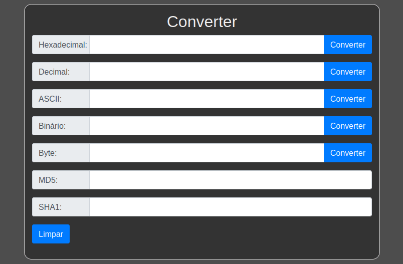

# :abacus: Unite Tool

:memo: The unit tool is very useful and was created to convert some types used during the development of an application.

:point_right: [Click here](https://unit-tool.netlify.app/) to use.



To clone the project with SSH:

```
git clone git@github.com:evandroad/unit-tool.git
```

To clone the project with HTTP:

```
git clone https://github.com/evandroad/unit-tool.git
```